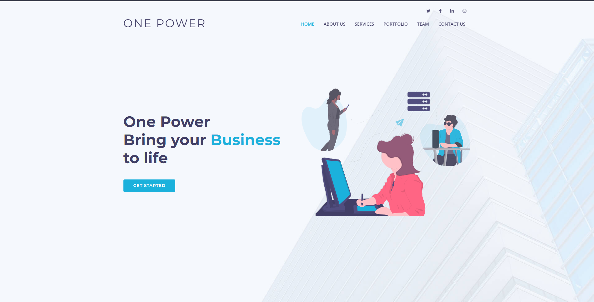
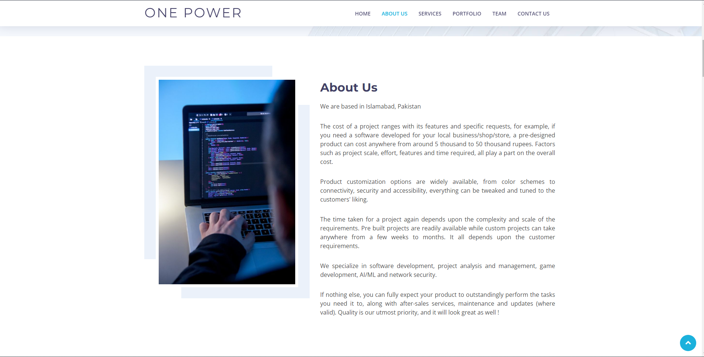
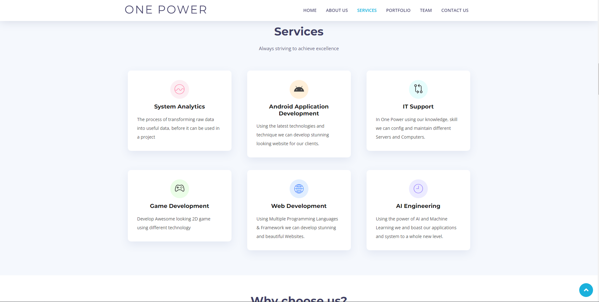
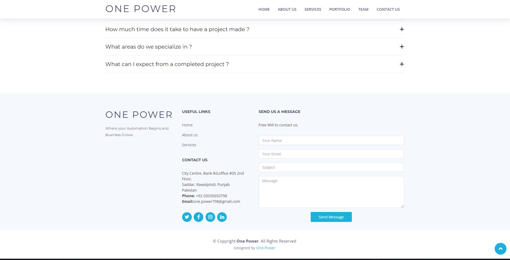

# Indroduction:
Hi! How are you?
<br>
Welcome to our organisation page on GitHub.<br>
We are a software company that develops and maintains multiple software projects for our clients.<br>
This is our website repository. In this project, we have created a simple website for our company.<br>

# Website Structure:
## Technologies:
The whole website is created using HTML, CSS, and JavaScript. The main framework that is used to develop this website is Node.js with EJS and Bootstrap. The website is hosted by Render. The website is also responsive and can be viewed on any device.
## Website Structure:
The website is divided into 4 main sections:

- Home
- About
- Services
- Contact

Each section of the website will define us and the work we have done in this industry.

## Website Deployed:
The website is deployed on Render. You can view the website by clicking [here](https://render.com/).

## Website Live Link:
The website is live and you can view the website by clicking [here](https://onepower.tech/).

## Website Preview:
This is a screenshot of the website. To check out the full website, visit the site.
### Home Page:


### About Page:


### Services Page:


### Contact Page:


# Running Website Locally:
In order to run the website locally, you need to have *** Node.js *** installed on your computer. Once you have Node.js installed, you can follow the following steps:
1. Clone the repository using the following command:
```
    git clone https://github.com/1-Power/1-Power-website.git
```

2. Enter the directory:
```
    cd 1-Power-website
```

3. Install all the dependencies using the following command:
```
    npm install
```

4. Run the website using the following command:
```
    npm start
```
5. Open the website on your browser using the following link:
```
    http://localhost:5000
```

# Website License:
This website is licensed under the [MIT License](./LICENSE)

# Code Contributation:
If you want to contribute to the code of this website, you can fork this repository and make a pull request. We will review your code and if it is good, we will merge it to the Development branch. Once the code is testing and is ready to be deployed, we will merge it to the main branch.

# Features Request or Any Other Issue:
## Feature:
For any feature is requested or sugestions then submit an issue [here](https://github.com/1-Power/1-Power-website/issues) using the following [template](./.github/ISSUE_TEMPLATE/feature_request.md).

## Bug:
If you find any bug in the website, then submit an issue [here](https://github.com/1-Power/1-Power-website/issues) using the following template [template](./.github/ISSUE_TEMPLATE/bug_report.md).

# Website Contributors:
- [Abdul Rafay](https://rafay99.info)
